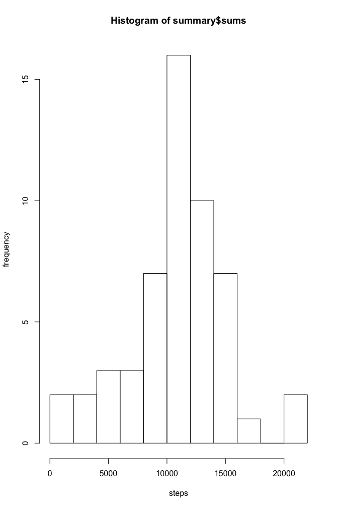
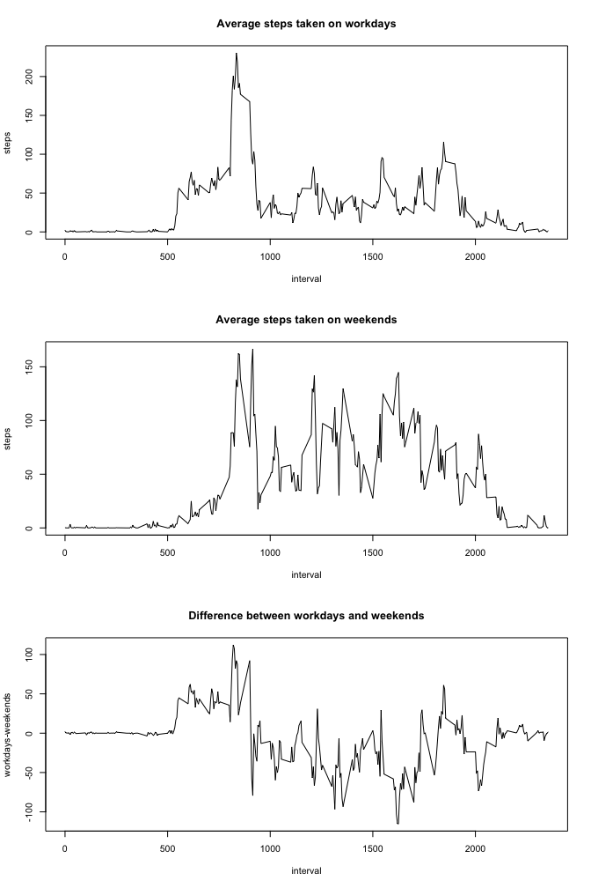

# Reproducible Research: Peer Assessment 1
Markus Scholz  

```r
library(dplyr)
```

```
## 
## Attaching package: 'dplyr'
```

```
## The following objects are masked from 'package:stats':
## 
##     filter, lag
```

```
## The following objects are masked from 'package:base':
## 
##     intersect, setdiff, setequal, union
```

## Load the data and do basic exploration

We directly read in the zip file be use of _unzip_

```r
data <- read.csv(unzip("./activity.zip"))
```

Next we have a look at the data and how it is formatted


```r
head(data)
```

```
##   steps       date interval
## 1    NA 2012-10-01        0
## 2    NA 2012-10-01        5
## 3    NA 2012-10-01       10
## 4    NA 2012-10-01       15
## 5    NA 2012-10-01       20
## 6    NA 2012-10-01       25
```

```r
tail(data)
```

```
##       steps       date interval
## 17563    NA 2012-11-30     2330
## 17564    NA 2012-11-30     2335
## 17565    NA 2012-11-30     2340
## 17566    NA 2012-11-30     2345
## 17567    NA 2012-11-30     2350
## 17568    NA 2012-11-30     2355
```

Obviously, missing values in the _steps_ variable are encoded as `NA`. I personally prefer `NaN` for missing values so lets change this first:


```r
data$steps[is.na(data$steps)] <- NaN
```

## Analysis of the daily activity

We use the `dplyr` package to analyse our data per day. First, we group the date by the date variable and afterwards we write a `summary` and look at the first values:


```r
dated <- group_by(data,date)
summary <- summarize(dated,means=(mean(steps,na.rm=TRUE)),medians=median(steps,na.rm=TRUE),sums=sum(steps))
head(summary)
```

```
## Source: local data frame [6 x 4]
## 
##         date    means medians  sums
##       (fctr)    (dbl)   (dbl) (dbl)
## 1 2012-10-01       NA      NA   NaN
## 2 2012-10-02  0.43750       0   126
## 3 2012-10-03 39.41667       0 11352
## 4 2012-10-04 42.06944       0 12116
## 5 2012-10-05 46.15972       0 13294
## 6 2012-10-06 53.54167       0 15420
```

Lets see how active the subject is by plotting a simple histogramm of the total number of steps taken per day, as stored in `summary$sums`


```r
hist(summary$sums,breaks=10,xlab = "steps",ylab="frequency")
```

<!-- -->

And now we calculate the `mean` and `median` of the total number of steps taken per day. Note, that we ignore `NaN` for the calculation. Otherwise, both, mean and median would be `NaN`! 


```r
mean_totals <- mean(summary$sums,na.rm=TRUE)
mean_totals
```

```
## [1] 10766.19
```

```r
median_totals <- median(summary$sums,na.rm=TRUE)
median_totals
```

```
## [1] 10765
```

As can be seen, mean and median are pretty close to each other. The interval with the maximum number of steps is


## What is the average daily activity pattern?

Next we would like to see how active the subject is in different phases of a day. So we again group our data, this time by the variable `interval` and we `summarize` the average number of steps and plot the result


```r
intervaled <- group_by(data, interval)
summary2 <- summarize(intervaled,meanPerInterval=(mean(steps,na.rm=TRUE)),medianPerInterval=(median(steps,na.rm=TRUE)))
plot(summary2$interval,summary2$meanPerInterval,type="l",xlab = "interval",ylab="average number of steps")
```

<!-- -->

## What is the interval with the maximum number of steps on average?
The interval can be determined with the following code:


```r
summary2$interval[summary2$meanPerInterval==max(summary2$meanPerInterval)]
```

```
## [1] 835
```


## Treating missing values

How many missing values do we have?

```r
sum(is.na(data$steps))
```

```
## [1] 2304
```
As we have seen, there are a lot of missing values in our data set. In total we have 2304 of them.
Since missing values may bias our analysis we may replace them with some resonable value. We choose the following approach:
- find a missing value
- replace it with the mean value of its 5-minute interval


```r
na_logi <- is.na(data$steps)
rep_summary2 <- rep_len(summary2$meanPerInterval,length.out = length(data$steps))
data <- mutate(data,steps_na_rm=steps)
data$steps_na_rm[na_logi] <- rep_summary2[na_logi]
sum(is.na(data$steps_na_rm))
```

```
## [1] 0
```


```r
dated <- group_by(data,date)
summary <- summarize(dated,means=(mean(steps_na_rm)),medians=median(steps_na_rm),
                     sums=sum(steps_na_rm))
head(summary)
```

```
## Source: local data frame [6 x 4]
## 
##         date    means  medians     sums
##       (fctr)    (dbl)    (dbl)    (dbl)
## 1 2012-10-01 37.38260 34.11321 10766.19
## 2 2012-10-02  0.43750  0.00000   126.00
## 3 2012-10-03 39.41667  0.00000 11352.00
## 4 2012-10-04 42.06944  0.00000 12116.00
## 5 2012-10-05 46.15972  0.00000 13294.00
## 6 2012-10-06 53.54167  0.00000 15420.00
```


```r
hist(summary$sums,breaks=10,xlab = "number of steps",ylab="frequency")
```

<!-- -->


```r
mean_totals_na_rm <- mean(summary$sums)
mean_totals_na_rm
```

```
## [1] 10766.19
```

```r
median_totals_na_rm <- median(summary$sums)
median_totals_na_rm
```

```
## [1] 10766.19
```

## Differences between workdays and weekend

To analyze the activity patterns and find differences between workdays and weekends we first of to add a new variable to our data set which stores the weekday abbreviation:


```r
data <- mutate(data,wkd=weekdays(as.POSIXct(data$date),abbreviate = TRUE))
```

Now we have to reshape our a data a little bit, such that we can compare weekends and workdays directly


```r
weed <- filter(data, wkd=="Sa" | wkd =="So")
wrkd <- filter(data,wkd!="Sa" & wkd!="So")
weed <- group_by(weed,interval)
wrkd <- group_by(wrkd,interval)
weed <- summarise(weed,weed_meansteps=mean(steps_na_rm))
wrkd <- summarise(wrkd,wrkd_meansteps=mean(steps_na_rm))
alldays <- mutate(wrkd,weed_meansteps=wrkd_meansteps)
alldays$weed_meansteps <- weed$weed_meansteps
alldays <- mutate(alldays, difference=wrkd_meansteps-weed_meansteps)
```

Lets plot the result as well as the difference between work- and weekenddays (workdays-weekends):


```r
par(mfrow=c(3,1))
plot(alldays$interval,alldays$wrkd_meansteps,type="l",xlab = "interval",ylab="steps",main="Average steps taken on workdays")
plot(alldays$interval,alldays$weed_meansteps,type="l",xlab = "interval",ylab="steps",main="Average steps taken on weekends")
plot(alldays$interval,alldays$difference,type="l",xlab = "interval",ylab="workdays-weekends",main="Difference between workdays and weekends")
```

<!-- -->
